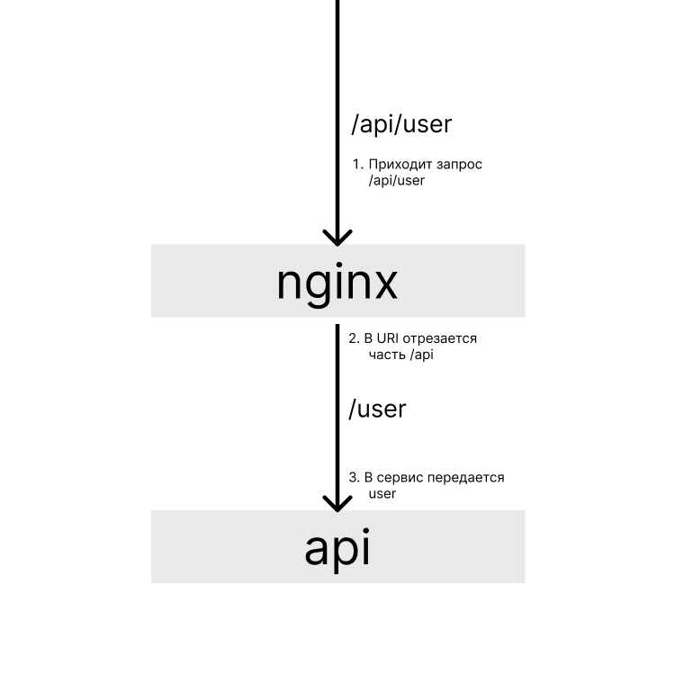

# nginx-proxy

Часто, вам придется настраивать перенаправление запроса на сервис который
запущен на локальной машине, либо на другом сервере.

Под одним доменом может быть запущена куча сервисов, от простой API до аналитики.
Для того чтобы объединить их в один домен, настраивают перенаправление запроса в
nginx. Например, запрос `https://jusan.kz/api/user/10` попадет на nginx сервер;
затем nginx отрезает часть `/api` и передает запрос на API как `jusan.kz/user/10`.

Передача запроса на сервис происходит следующим образом:



### Полезное

- [NGINX Reverse Proxy](https://docs.nginx.com/nginx/admin-guide/web-server/reverse-proxy/)
- [Проксирование запросов в nginx с помощью proxy_pass](https://serveradmin.ru/nginx-proxy_pass/)
- [Nginx reverse proxy + URL rewrite](https://serverfault.com/questions/379675/nginx-reverse-proxy-url-rewrite)

На сервере в качестве systemd сервиса запущена API на порту 9090.

### Задание

1. Добавьте `location /`, который обслуживает файл [index.html](https://stepik.org/media/attachments/lesson/686238/index.html).
2. Добавьте `location /api`, который удаляет `/api` из URI и перенаправляет запрос на `localhost:9090`.

Для проверки, сделайте следующий запрос:

```bash
$ curl http://localhost/api/
web-server: 0
```

---

### Ответ
### Использовал свои сервера ссылка localhost:8085/api/ перенаправляет на localhost:89 без префикса api
```
server {
    listen 89;
    server_name localhost;

    # Обслуживание файла index.html на пути /
    location / {
        root /var/www/html/nginx-proxy/;  # Укажите путь к каталогу, где находится index.html
        index index.html;
    }
# Проксирование запросов к API
# Проксирование запросов к API, удаляя префикс /api
    location /api/ {
        rewrite ^/api(.*)$ /$1 break;
        proxy_pass http://localhost:8085/;
        proxy_set_header Host $host;
        proxy_set_header X-Real-IP $remote_addr;
        proxy_set_header X-Forwarded-For $proxy_add_x_forwarded_for;
        proxy_set_header X-Forwarded-Proto $scheme;
    }
}
```
